# C++和客户端

这个文档使用的Demo例子是：

* [Aura](https://github.com/Genius-pig/Aura)
* [UEInterviewDemo](https://github.com/Genius-pig/UEInterviewDemo)
* Cropout官方

### 1. 使用C++创建一个继承自AActor的枪支类，在这个类中，创建两个组件:骨骼模型组件，粒子组件。他们分别作为枪支外形和火舌
- 请分别写出这两个组件的声明和创建过程。
- 满足声明的宏标记，要求骨骼模型组件可在蓝图中被默认定义，粒子组件任何时候可以被定义。
- 实现中，骨骼模型作为root组件节点，粒子组件挂载到根骨骼模型上。

关于EditDefaultOnly和EditAnywhere的区别，请看[视频](https://www.youtube.com/watch?v=arCwPQEDsmI)。一句话概括就是EditAnyWhere既可以在编辑器里更改，也可以在被实例化的时候更改（比如你把你定义的Actor拖拽到World上运行）。请看[UEInterviewDemo](https://github.com/Genius-pig/UEInterviewDemo)里的Contents/Weapons/ShortGun。

```c++
	UPROPERTY(EditDefaultsOnly)
	TObjectPtr<USkeletalMeshComponent> WeaponSkeletalMesh;
	
	UPROPERTY(EditAnywhere)
	TObjectPtr<UNiagaraComponent> FireEffect;
```

```c++
	WeaponSkeletalMesh = CreateDefaultSubobject<USkeletalMeshComponent>("Weapon");

	SetRootComponent(WeaponSkeletalMesh);

	FireEffect = CreateDefaultSubobject<UNiagaraComponent>("FireEffect");
	FireEffect->SetupAttachment(RootComponent);
```

### 2. 请简要阐述UFUNCTION()中
- BlueprintCallable,BlueprintPure的区别是什么？
- BlueprintImplementableEvent有什么用？
- BlueprintNativeEvent有什么用？

[参考连接](https://www.tomlooman.com/unreal-engine-ufunction-specifiers/)

#### BlueprintCallable,BlueprintPure的区别是什么？

区别是BlueprintCallable有执行线，BlueprintPure没有。

[](https://imgse.com/i/pPqSHM9)

```c++
	UFUNCTION(BlueprintPure)
	int GetWeaponSize();

	UFUNCTION(BlueprintCallable)
	void DestroyWeapon();
```
#### BlueprintImplementableEvent有什么用？

BlueprintImplementableEvent只能在蓝图实现，常常与BlueprintCallable相配合使用。

#### BlueprintNativeEvent有什么用？

与BlueprintImplementableEvent有区别的是，BlueprintNativeEvent可以在C++中写Native方法，C++ Native为后缀一般以_Implementation，并可以在蓝图中重写。

详细参考见[Aura](https://github.com/Genius-pig/Aura)中的Source/Aura/Public/Iteraction/CombatInterface.h。

### 3. 请简要阐述AnimBP的动画状态机和Montage

- 他们分别适用在什么情景？
- 哪一个更适合用在做近战攻击?
- 如果实现一个上下肢分离的换子弹动画(边跑步，边换弹)，应该怎么做？
- 怎么创建根骨骼动画节点，以方便在代码里调用？
- 简单阐述，Montage动画播完如何获取响应事件？

#### 他们分别适用在什么情景？ 

状态机更适用在动画过渡，比如从idle到跑步，Montage适合触发事件，Montage可以被分到不同的Slot里。Montage可以和GAS配合使用。Montage只有在AnimBP里有这个Slot和PlayMontage这两个同时存在才会播放动画。

[](https://imgse.com/i/pPq9l1e)

[](https://imgse.com/i/pPq967q)

[](https://imgse.com/i/pPq92NV)

#### 哪一个更适合用在做近战攻击?

Montage

#### 如果实现一个上下肢分离的换子弹动画(边跑步，边换弹)，应该怎么做？

可以用Layered blend per bone

[](https://imgse.com/i/pPqCpDA)

#### 怎么创建根骨骼动画节点，以方便在代码里调用？

[](https://imgse.com/i/pPqCcKH)

在骨骼处添加socket，c++用GetSocketLocation。

```c++
GetMesh()->GetSocketLocation(LeftHandSocketName);
```

#### 简单阐述，Montage动画播完如何获取响应事件？

[](https://imgse.com/i/pPqCjI0)

如果使用GAS的话，可以使用PlayMontageAndWait。

### 4. 请创建一个DataTable的结构，用于管理枪支系统的参数

- 创建继承自虚幻提供的FTableRowBase的结构，结构名FGunData。
- 该结构中有，枪支ID，枪支名字，子弹数目，icon图标和引用的Edit生成类。
- 请写出基于枪支ID遍历的函数。

```c++
#pragma once

#include "CoreMinimal.h"
#include "Engine/DataAsset.h"
#include "Engine/DataTable.h"
#include "WeaponInfo.generated.h"

USTRUCT(BlueprintType)
struct FGunData : public FTableRowBase
{
	GENERATED_BODY();

	UPROPERTY(EditDefaultsOnly, BlueprintReadOnly)
	int32 WeaponID;

	UPROPERTY(EditDefaultsOnly, BlueprintReadOnly)
	FName WeaponName;

	UPROPERTY(EditDefaultsOnly, BlueprintReadOnly)
	int32 BulletNumber;

	UPROPERTY(EditDefaultsOnly, BlueprintReadOnly)
	TObjectPtr<const UTexture2D> Icon = nullptr;
};

/**
 * 
 */
UCLASS()
class UEINTERVIEWDEMO_API UWeaponInfo : public UDataAsset
{
	GENERATED_BODY()
public:
	UPROPERTY(EditDefaultsOnly, BlueprintReadOnly, Category = "WeaponInformation")
	TArray<FGunData> WeaponInfo;

	FGunData FindInfoForID(int32 ID);
};
```

```
#include "Data/WeaponInfo.h"

FGunData UWeaponInfo::FindInfoForID(int32 ID)
{
	for (int i = 0; i < WeaponInfo.Num(); i++)
	{
		if (WeaponInfo[i].WeaponID == ID)
		{
			return WeaponInfo[i];
		}
	}

	return FGunData();
}
```

[](https://imgse.com/i/pPqPIT1)

### 5. 请简述AI的BehaviorTree以下节点的功能
- Service，Task和Decorator的功能。
- 如果敌人寻路到玩家跟前，执行攻击，应该选择上述哪个节点进行功能实现？

#### Service，Task和Decorator的功能。

Service和Decorator都依附于Composite和Task。Decorator最经典的就是Blackboard，根据Blackboard的值来决定是否执行分支。Service最经典的就是Run EQS，对周边环境进行查询。

Decorator：条件节点，是否执行分支。
Service：非条件节点，执行服务，并以自己的频率。

Task：任务节点，可以包含多个Decorator和Service。可以理解成树中的叶子节点。
Composite：分支节点，可以包含多个Decorator和Service。可以理解为树的分支节点。

详情请见我的[知乎文章](https://zhuanlan.zhihu.com/p/643179445)

#### 如果敌人寻路到玩家跟前，执行攻击，应该选择上述哪个节点进行功能实现？

首先实现一个Service叫FindNearPlayers（啥名都可以）在Composite，如果找到了在Task上实现攻击。

[](https://imgse.com/i/pPqiJB9)

具体AI实现可看Aura的Content\Blueprints\AI\BehaviorTree

### 6. 什么是虚幻引擎蓝图？请简要解释其作用和用途。

图形化编程，可以实现虚幻大部分功能。

### 7. 请解释虚幻引擎蓝图中的事件（Event）图和脚本图之间的区别。

Event有点像函数，它是执行一个网络的开端。脚本就是每个蓝图节点。

[](https://imgse.com/i/pPqiw9K)

### 8. 如何创建一个新的虚幻引擎蓝图类？

写个c++基类，然后继承这个c++类去创建一个蓝图。

### 9. 你能解释蓝图的变量是什么吗？它们有哪些不同的数据类型？

蓝图变量相当于C++ class里的成员变量，蓝图本地变量相当于C++ 函数内变量。可以有任何虚幻支持的数据类型。

### 10. 如何在虚幻引擎蓝图中创建自定义函数？

[](https://imgse.com/i/pPqif9f)

点那个加号。

### 11. 什么是蓝图接口？请提供一个使用蓝图接口的示例。

首先接口是给不同类提供相同的函数，但是可以有不同的实现。在蓝图Interface里只能有函数。本案例来源于官方案例Cropout。

定义蓝图接口

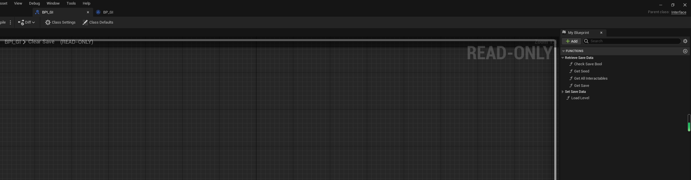

添加需要实现的实现蓝图接口

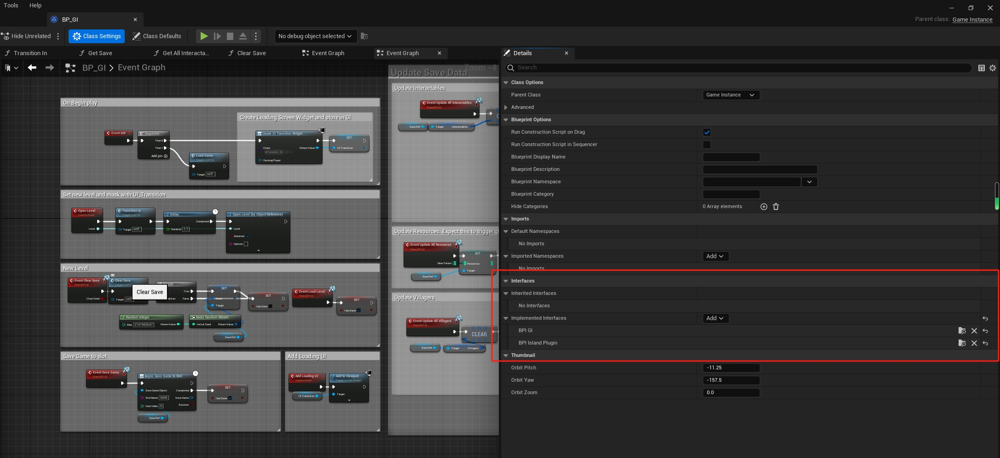

在蓝图里实现接口。

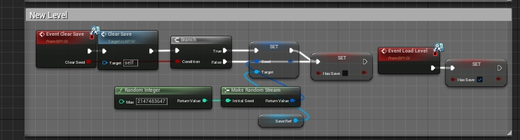

### 12. 如何在虚幻引擎蓝图中实现条件分支？请提供一个示例。

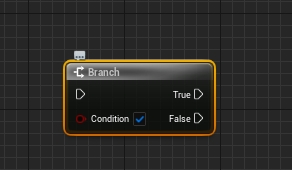

### 13. 你如何在蓝图中实现循环结构？请提供一个示例。


### 14. 请解释虚幻引擎蓝图中的事件触发器是什么以及如何使用它们。
当一个物体走进一个触发器时，就会触发一个自定义函数来达到一定的效果。

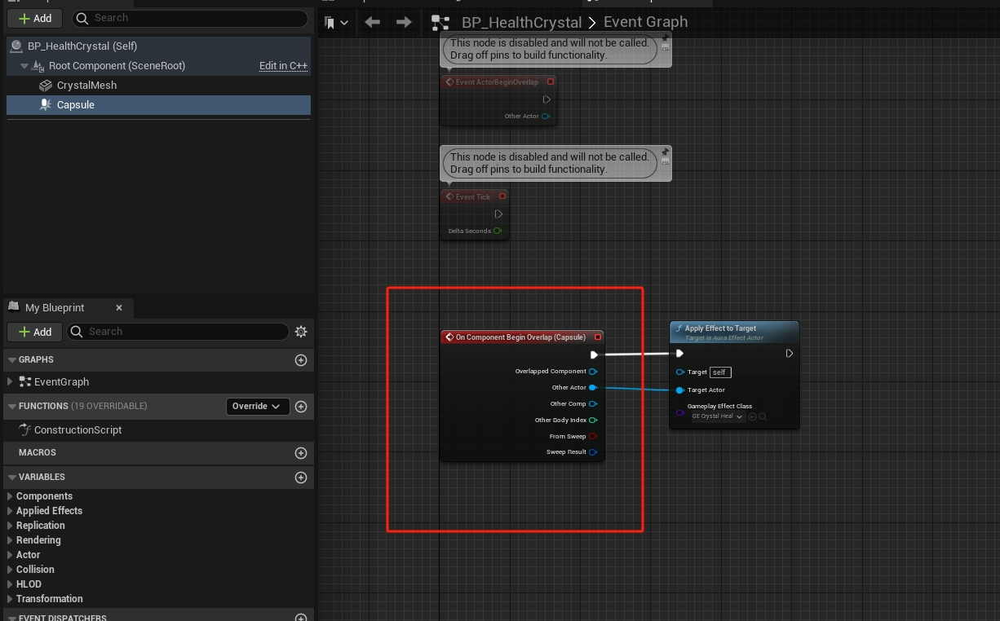

### 15. 能否简要解释虚幻引擎蓝图中的状态机，并提供一个实际用例？

状态机（State Machines） 通过图形化方式将骨架网格体的动画拆分为一系列状态。然后按照 转换规则 管理这些状态，转换规则可控制从一个状态混合到另一个状态。状态机大大简化了骨架网格体动画的设计流程，可以创建一张控制图来轻松控制各个角色在各动画之间运动方式，无需创建复杂的蓝图网。用途是动画过渡。和第三问一致。

### 16. 如何在蓝图中实现网络功能，以支持多人游戏？请提供一个简单的示例。

这个问题太宽泛了。请看我的[知乎文章](https://zhuanlan.zhihu.com/p/610252998)。

### 17. 如何处理虚幻引擎蓝图中的输入事件，例如键盘按键或鼠标点击？

在虚幻5后，输入变成了Enhanced input。具体触发流程如图下所示。

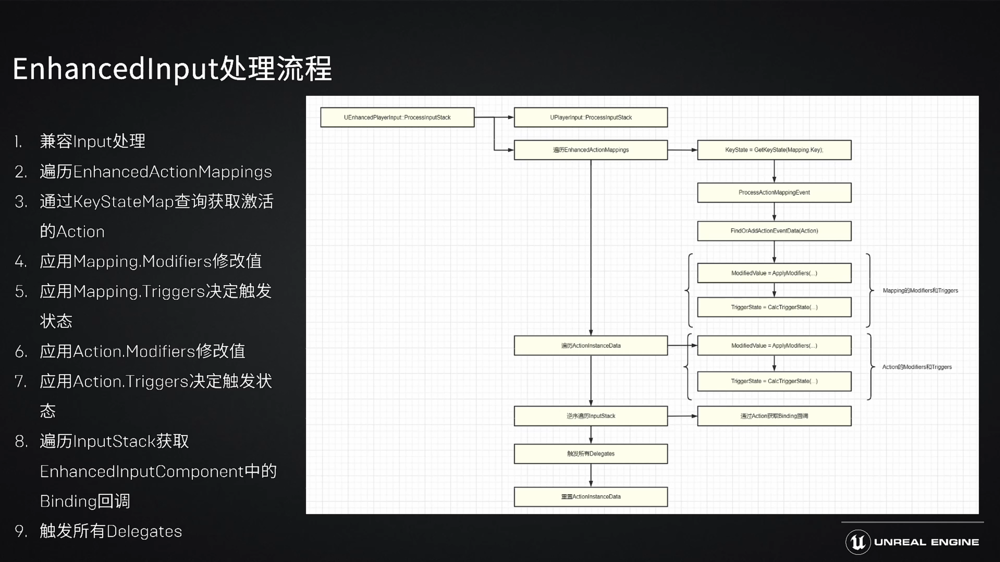

### 18. 你是否了解虚幻引擎的蓝图通信机制？请解释并提供一个示例。

#### 对象引用

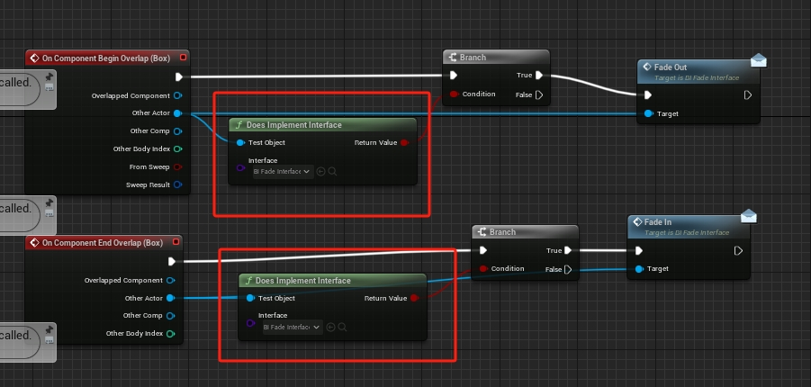

#### 类型转换

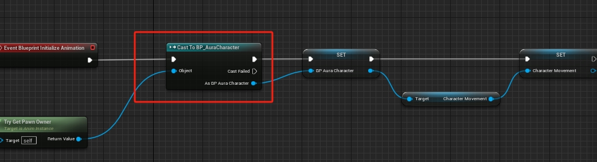

#### 蓝图接口

见第11问

#### Event Dispatcher

一种委派（delegate）。比如在当你打开一个UI控件的时候，想让Button disabled，关掉的时候enabled。这时候你就可以用一个Event Dispatch完成父UI和子UI之间的信息交流。

### 19. 如何在虚幻引擎蓝图中实现粒子效果或特效？

Niagara

### 20. 你能解释虚幻引擎蓝图中的延迟节点，并提供一个用例吗？

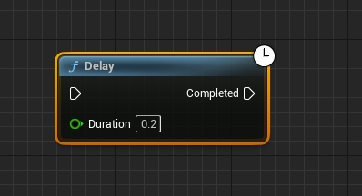

UI中回血可以用delay来达到先快速达到灰色进度条，然后再慢慢回血。当然可以不用delay来实现。

### 21. 你如何调试虚幻引擎蓝图中的问题？

加断点
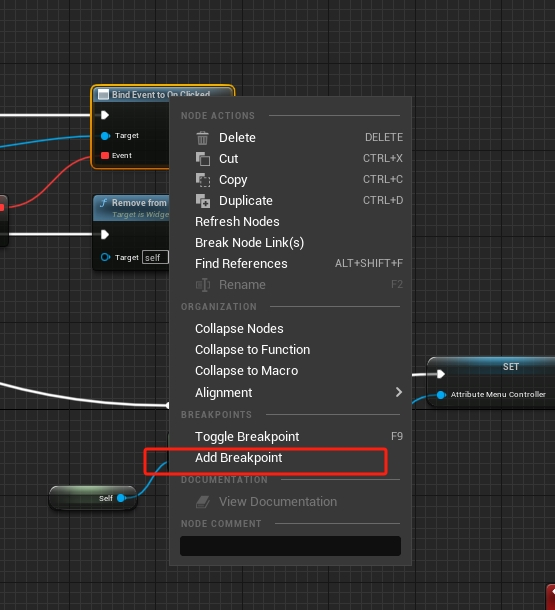

### 22. 请解释虚幻引擎的Garbage Collection（垃圾回收）是什么，以及如何避免或优化GC的影响？

UE采用了标记-清扫的垃圾回收方式，是一种经典的垃圾回收方式。一次垃圾回收分为两个阶段。第一阶段从一个根集合出发，遍历所有可达对象，遍历完成后就能标记出可达对象和不可达对象了，这个阶段会在一帧内完成。第二阶段会渐进式的清理这些不可达对象，因为不可达的对象将永远不能被访问到，所以可以分帧清理它们，避免一下子清理很多 UObject，比如 map 卸载时，发生明显的卡顿。

垃圾回收是常见的内存自动管理，就是当一个变量没有用的时候，系统就会自动回收它。垃圾回收在C++里是没有的，但是在其他语言像java，c#，python中是十分常见的。

在成员变量中加`UPROPERTY()`就可以避免内存回收。用`MarkAsGarbage()`可以把`UPROPERTY()`成员变量标记为可以内存回收。具体看这个[视频](https://www.youtube.com/watch?v=fYktCdC_4IM)。在UEInterviewDemo也有。

### 23. 你能详细解释虚幻引擎的TArray和TMap容器类，并说明何时使用它们以及它们的性能特性？

#### TArray

是UE中最常用的容器类，负责同类型其他对象（称为"元素"）序列的所有权和组织。由于TArray是一个序列，其元素的排序定义明确，其函数用于确定性地操纵此类对象及其顺序。插入删除的复杂度是O(1)~O(n)。

在需要顺序数组的时候使用。

#### TMap

TMap是用基于数组的哈希表实现的，查询效率高，添加、删除效率低，查询的时间复杂度是O(1)。TMap的排序采用的快速排序，时间复杂度为O(nlogn)。

|  | 数据结构 | 查询时间复杂度 | 优点 | 缺点 |
| -----| ---- | ---- | ---- | ---- |
| map | 红黑树 | O(logn) | 内部自动排序，查询、添加、删除效率相同 | 空间占用较大 |
| unordered_map | 哈希表 | 	O(1) | 	查询效率高 | 内部元素无序杂乱添加、删除效率低 |
| TMap | 哈希表 | 	O(1) | 	查询效率高 | 内部元素无序杂乱添加、删除效率低 |

在需要键值对的时候使用。

### 24. 什么是虚幻引擎的蓝图扩展（Blueprint Native Events）？请提供一个示例，说明如何在C++中扩展蓝图功能。

与第二题的第三个小问一样。

### 25. 请描述虚幻引擎中的Actor生命周期，包括BeginPlay、Tick、EndPlay等事件的触发时机和作用。

Actor从BeginPlay开始，Tick每一帧运行，到EndPlay结束。

了解这个问题，我们首先在打上三个断点。从IDE上看调用栈。

下图为BeginPlay调用栈。你在点击Editor的开始按钮的时候，调用一次BeginPlay函数。

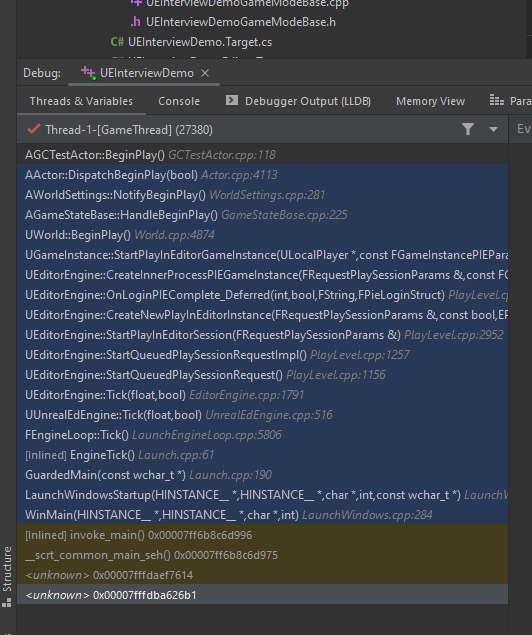

下图为Tick调用栈。你在点击Editor的开始按钮的时候后，每一帧都会调用Tick函数。

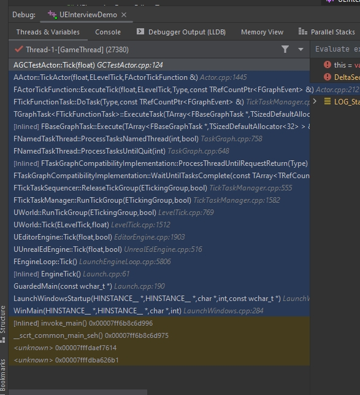

下图为EndPlay调用栈。你在点击Editor的结束按钮的时候后，调用一次End函数。

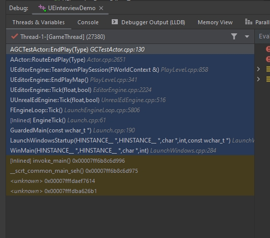

### 26. 如何在虚幻引擎中实现自定义的AI行为和决策树

#### 自定义Service

可以继承自`UBTService_BlueprintBase`。在`TickNode`写自己的逻辑，并可以修改Blackboard的值。

```C++
	virtual void TickNode(UBehaviorTreeComponent& OwnerComp, uint8* NodeMemory, float DeltaSeconds) override;

	UPROPERTY(BlueprintReadOnly, EditAnywhere)
	FBlackboardKeySelector TargetToFollowSelector;

	UPROPERTY(BlueprintReadOnly, EditAnywhere)
	FBlackboardKeySelector DistanceToTargetSelector;
```

#### 自定义Task

可以继承自`UBTTask_BlueprintBase`。在`ExecuteTask`写自己的逻辑。

```c++
virtual EBTNodeResult::Type ExecuteTask(UBehaviorTreeComponent& OwnerComp, uint8* NodeMemory) override;
```

### 27. 你能解释虚幻引擎的引擎子系统（Engine Subsystems）是什么，以及如何创建自定义的子系统？

子系统是比设计模式单例模式更加深刻的延伸。虚幻有一些它称之为子系统的东西，可以用来创建全局可访问的模块，这些模块具有明确定义的生命周期。子系统的生存期将与其父子系统的生存期相匹配。 有5个不同的父类可供选择 。比如你继承一个UEngineSubsystem，详情请看[这篇](https://zhuanlan.zhihu.com/p/616324045)。

| Subsystem | Parent Class | Lifetime | 
| -----| ---- | ---- |
| Engine | UEngineSubsystem | 编辑器和游戏都存在 |
| Editor | UEditorSubsystem | 当启动编辑器时 |	
| GameInstance | UGameInstanceSubsystem | 从游戏开始到游戏结束 | 
| LocalPlayer | ULocalPlayerSubsystem | 和ULocalPlayer生命周期一样，在level之间1穿梭 |
| World | UWorldSubsystem | 和UWorld生命周期一样，每一个level都有效 |

### 28. 什么是虚幻引擎中的反射系统，以及它如何与C++代码交互？

参考：

* [Unreal Property System (Reflection)](https://www.unrealengine.com/en-US/blog/unreal-property-system-reflection)
* [Unreal Engine Reflection System](https://docs.unrealengine.com/5.0/en-US/reflection-system-in-unreal-engine/)

#### 反射在java

Java的反射机制是指在程序的运行状态中，可以构造任意一个类的对象，可以了解任意一个对象所属的类，可以了解任意一个类的成员变量和方法，可以调用任意一个对象的属性和方法。这种动态获取程序信息以及动态调用对象的功能称为Java语言的反射机制。

其实Java的反射和虚幻的反射是十分相似的，无非就是程序在运行时评估自己。在虚幻中，你可以给程序加上类似`UClass`的宏，所以你就可以在Editor编辑它。

#### 如何和C++交互

* 虚幻的基础对象是`UObject`，为每个`Actor`和`Object`提供模板。
* 你可以用宏`UClass`去标记继承自`UObject`的类，这样的话[UObject handling system](https://docs.unrealengine.com/5.0/en-US/unreal-object-handling-in-unreal-engine/)就可以意识到右这个类。更多[宏](https://docs.unrealengine.com/5.0/en-US/metadata-specifiers-in-unreal-engine/)，如`UEnum`等。
* TSubclassOf是一个模板类，为Unreal Engine提供了UClass类型安全性。比如我声明了一个UAuraUserWidget类型的TSubclassOf。如果我写一个蓝图类继承这个含有这个OverlayWidgetClass的C++类，我就只能选择UAuraUserWidget的子类或者本类。参考[代码](https://github.com/Genius-pig/Aura/blob/master/Source/Aura/Public/UI/HUD/AuraHUD.h)。

### 29. 如何在虚幻引擎中创建自定义的工具面板（Editor Utility Widgets）？


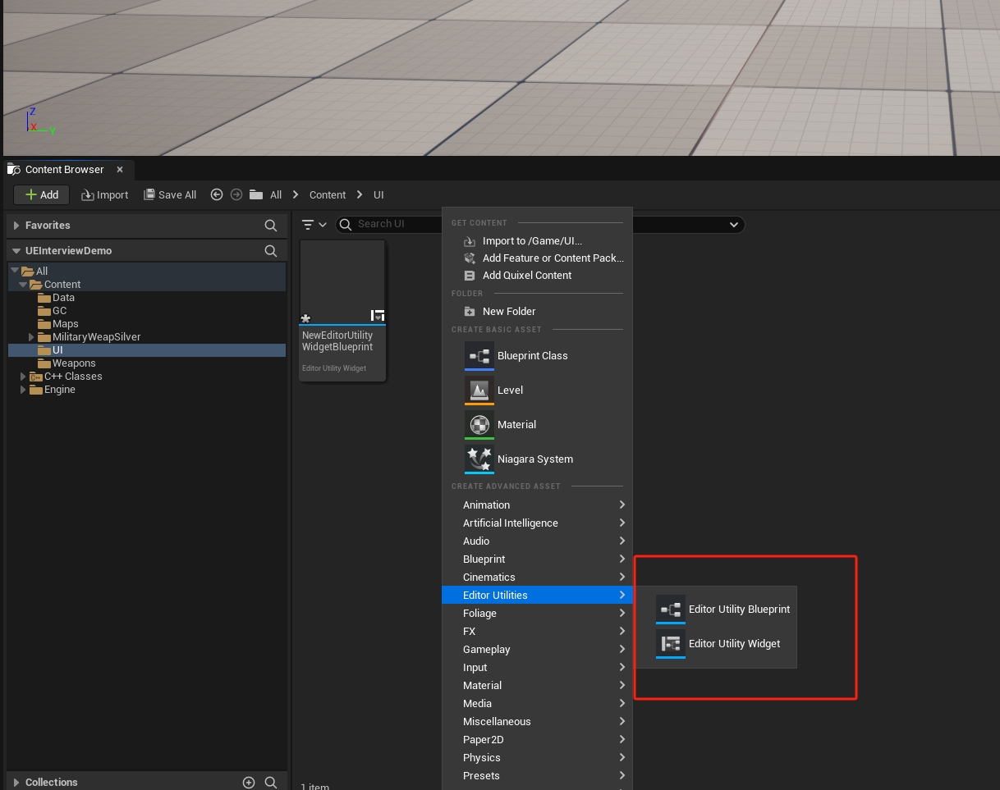

### 30. 你有使用过虚幻引擎的AI感知系统吗？详细说说


### 31. 如何在虚幻引擎中实现自定义的多边形碰撞检测，而不使用物理引擎？

在这里加Collision。

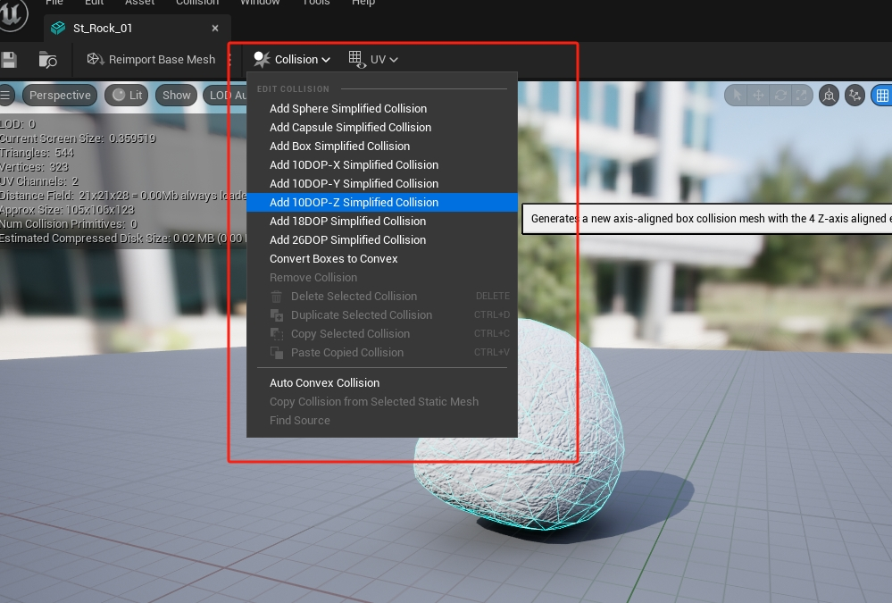

可以自定义简单多边形或者其他形状的碰撞检测。

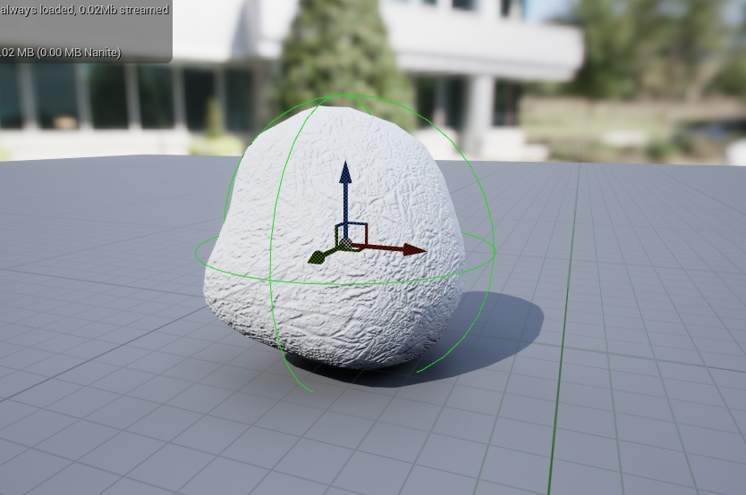

### 32. 能否解释虚幻引擎的SaveGame系统，并提供一个实际用例？

### 35. 请描述虚幻引擎的渲染管线（Rendering Pipeline）中的主要阶段和它们的作用。

https://zhuanlan.zhihu.com/p/137780634

Vertex Shader → Tessellation → Geometry Shader → Rasterization → Fragment Shader

做个简单总结：Vertex shader做的就是把物体进行空间变换，变换到摄像机能看到的位置，添加光照信息（那个切线空间插值？）

Tessellation做细分的，贴图置换，其中Bump和Displacement贴图就是在这里算的？

Geometry Shader增加新图元，应用为LOD。

Rasterization 光栅化我觉得是把投射到屏幕上的点用片元表示。

Fragment Shader （Pixel Shader）为每个片元计算颜色。对法线纹理采样后，直接进行光照计算。


### 36. 如何在虚幻引擎中实现自定义的渲染通道（Rendering Pass）或后处理效果？

[参考](https://unrealartoptimization.github.io/book/profiling/passes/)

### 37. 切线空间有什么用

https://www.zhihu.com/question/23706933

https://zhuanlan.zhihu.com/p/139593847

自己做一个简单总结，法线贴图是由UV纹理和坐标计算而来，UV和切线空间（BT）并不重合。切线空间的用处我感觉就是和UV强相关，所以切线空间最大作用就是生成法线贴图。

### 38. 左右值

https://zhuanlan.zhihu.com/p/526034602

左值就是取地址值，


